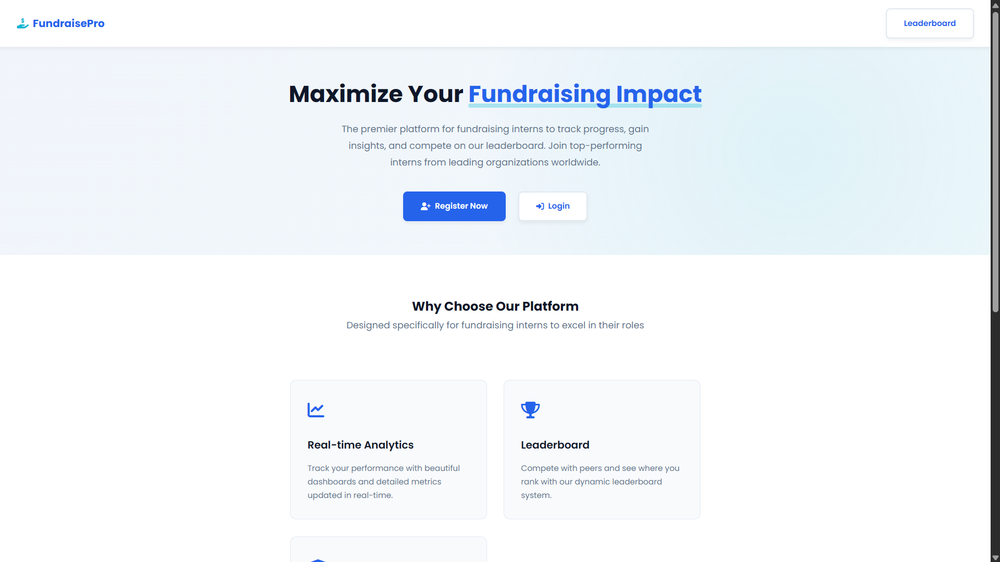
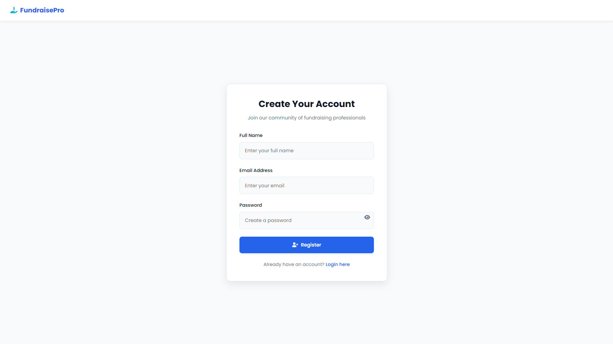
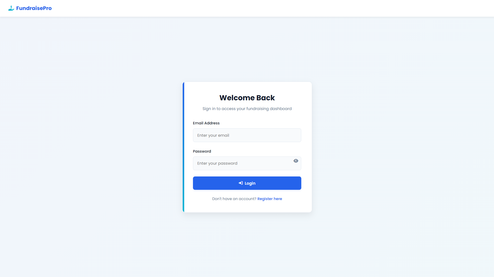
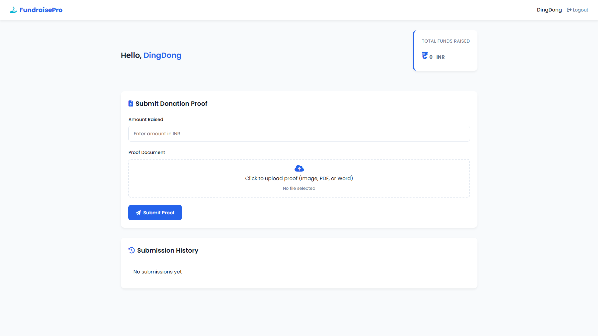
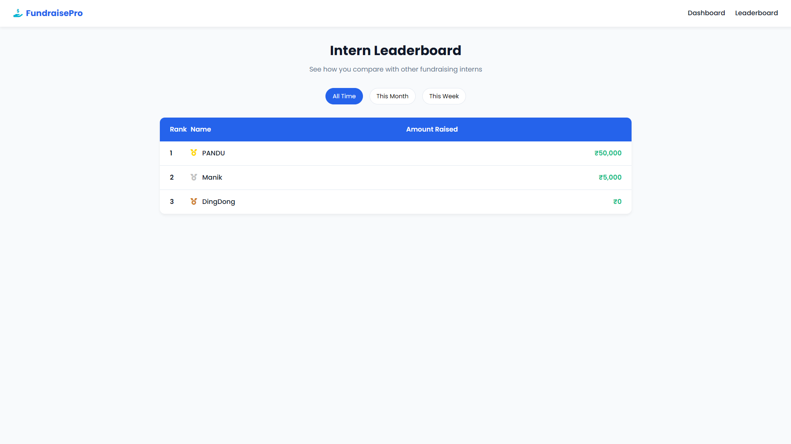

# 🎯 Fundraising Intern Portal

Intern tracking and management system built using **Node.js**, **Express.js**, and **MongoDB**, designed to manage intern activities such as registration, login, dashboards, leaderboard rankings, and file submissions.

---

## 🚀 Features

- 🔐 Intern Registration & Login (with validation)
- 🧑‍💻 Personalized Intern Dashboard
- 🏆 Leaderboard System to rank interns based on performance
- 📤 File Upload Functionality (Resumes, Reports, etc.)
- 📊 Admin control (optional extension)
- 📈 Scalable MongoDB backend
- 🎨 Clean, responsive frontend UI

---

## 🧰 Tech Stack Used

**Frontend:**
- HTML5, CSS3, JavaScript
- Bootstrap (for styling)

**Backend:**
- Node.js
- Express.js
- MongoDB + Mongoose
- dotenv for environment config
- cors & body-parser middleware

**Others:**
- Multer for file uploads
- Git & GitHub for version control

---

## 🛠️ Setup Instructions

Follow the steps below to run the project locally:

\`\`\`bash
# 1. Clone the repository
git clone https://github.com/Jayanandmanik/fundrising_intern_portal.git

# 2. Navigate to the project folder
cd fundrising_intern_portal

# 3. Install dependencies
npm install

# 4. Configure environment variables
Create a .env file and add the following:
PORT=3007   
MONGODB_URI=your_mongodb_connection_string

# 5. Start the server
node app.js
\`\`\`

---

## 📸 UI Screenshots

> *(Replace with actual image paths or GitHub-hosted links)*


### 🔐 Home Page


### 🔐 Registration Page  


### 🔐 Login Page  


### 🏠 Intern Dashboard  


### 🏆 Leaderboard  



---

## 🌐 Deployment (If hosted)

- **Live URL:** [https://fundraising-intern-portal.netlify.app](https://fundraising-intern-portal.netlify.app) *(replace with your actual deployment link)*
- **Backend Hosted On:** Render / Vercel / Railway *(update if deployed)*

---


## 📂 Folder Structure

```
fundrising_intern_portal/
├── routes/
│   ├── auth.js
│   ├── dashboard.js
│   └── leadboard.js
├── models/
│   ├── user.js
│   └── submission.js
├── public/
│   ├── dashboard.html
│   ├── index.html
│   ├── leadboard.html
│   ├── login.html
│   └── register.html
├── uploads/
│   └── (uploaded files)
├── app.js
├── package.json
└── README.md
```

---

## 📧 Contact
9010347518
For queries or collaboration:  
**Jayanand Manik Maddirala**  
📧 jayanandmanik3@gmail.com
🔗 [LinkedIn](https://www.linkedin.com/in/jayanand-manik-maddirala)